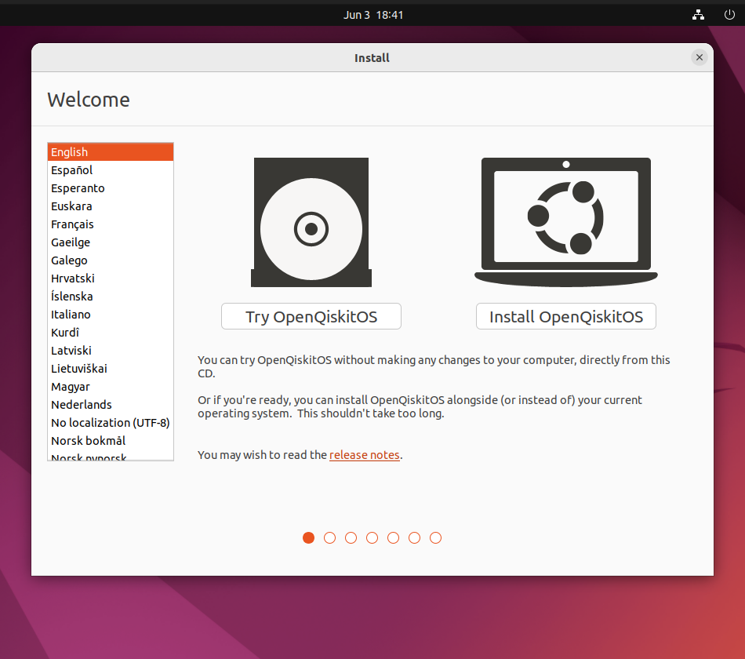
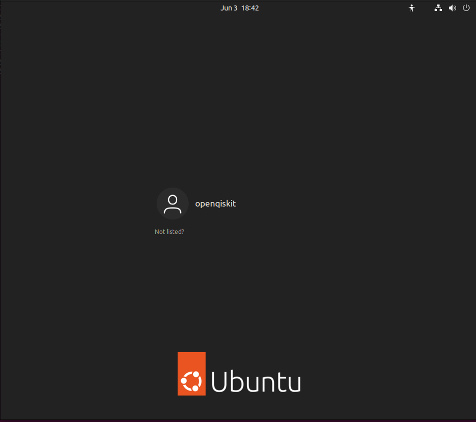
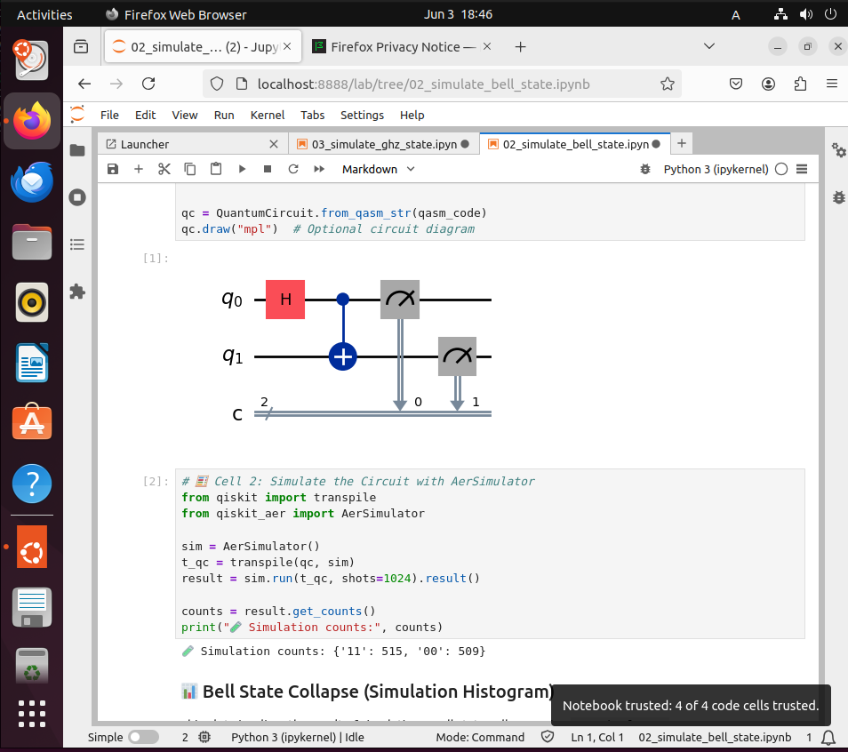
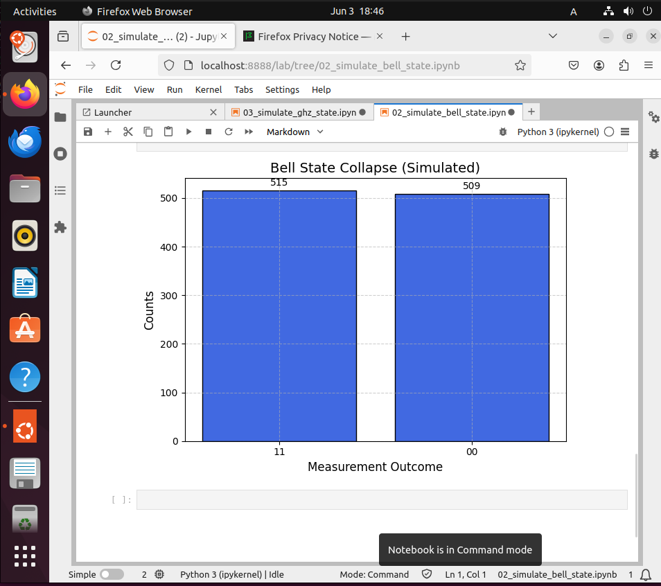
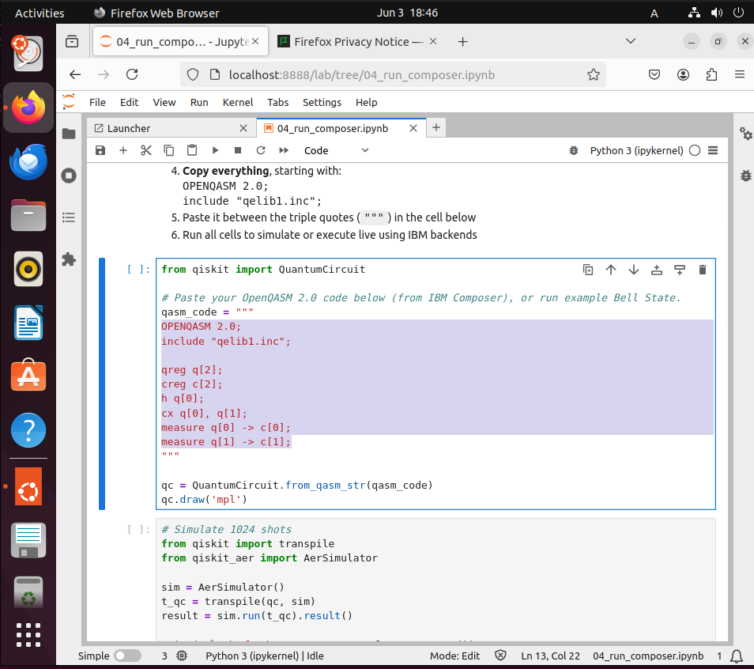

# OpenQiskitOS

A bootable Linux ISO for quantum computing — no pip hell, no broken kernels. Just circuits.

OpenQiskitOS includes:
- Python 3.11
- Qiskit 2.x (preinstalled)
- JupyterLab 4.x
- A prewired virtual environment (`qiskit_env_arm64`)
- A one-touch launch script: `start_q.sh`

## 🚀 Quick Start

1. Flash the ISO to a USB drive  
2. Boot into the live environment (Default password:qiskit) 
3. Wait for `start_q.sh` to auto run

That’s it. JupyterLab will launch and you're ready to build quantum circuits.

---

Want to try it yourself?  
📀 [Download ISO](https://archive.org/details/openqiskitos-v0.1.2)  
💾 [Source on GitHub](https://github.com/LyndonShuster/OpenQiskitOS)

---

## 🚀 OpenQiskitOS Preview

OpenQiskitOS is a bootable Linux ISO for learning and exploring quantum computing with Qiskit — no installation or cloud login required, persistent login supported.

---

### 🧭 Try OpenQiskitOS Boot Menu

---

### 🔐 Login Screen

---

### 🖥️ Desktop Environment + Auto-Launch JupyterLab

---

### 🔗 Bell State Simulation Circuit (Qiskit)

---

### 📊 Simulation Output Histogram

---

### 🧪 QASM Input Support (for power users)

